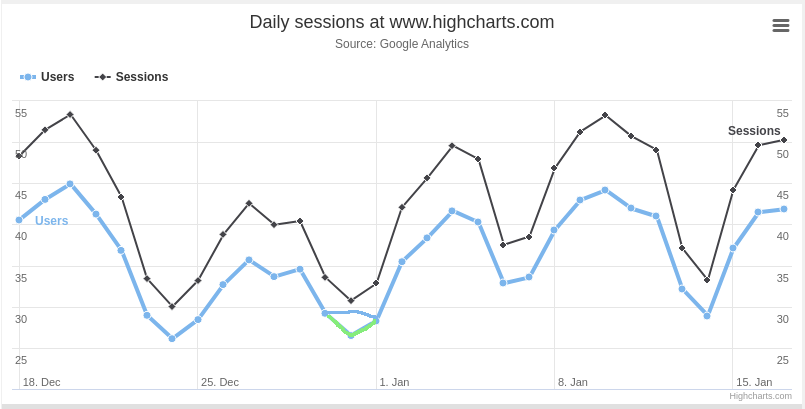
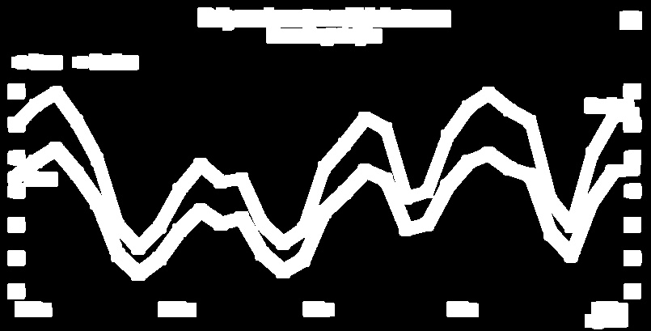

==============
Visual Testing
==============

.. currentmodule:: dollarx

.. contents:: :local:

Resizing the browser or an element
==================================
In some cases there may be a need to make sure that the browser always has predefined dimensions. This is useful, \
for example, when capturing/asserting images.
There are two classes that allow to do it:

* \ :java:ref:`WindowResizer`\   - resize for the browser
* \ :java:ref:`ElementResizer`\   - resize an element

Example use:

.. code-block:: java

      try (WindowResizer windowResizer = new WindowResizer(1000, 768)) {
          try (ElementResizer elementResizer = new ElementResizer(div.that(hasClass("widget-pane")), 600, 400)) {
              System.out.println(String.format("element total dimensions: %d, %d", elementResizer.getTotalWidth(), elementResizer.getTotalHeight()));
              System.out.println(String.format("element visible dimensions: %d, %d", elementResizer.getVisibleWidth(), elementResizer.getVisibleHeight()));

              // do something with the image inside the resized element
          }
      }
      // at this point everything is reverted to the original state

Capturing and validating images
===============================
Dollarx offers the ability to capture an image(ie. screenshoot) of a Path element, and asserting it \
looks as expected.
All the functionality is under  \ :java:ref:`SingltonBrowserImage`\    and \ :java:ref:`Images`\   .

It has separate hanling for HTML 5 canvas elements, which allows to download just the image data for that \
element, thus is more optimized.
It also supports capturing an the source of and HTML img element from its URI.

Displaying an image of an element
---------------------------------
It is possible to capture and display the image for a given element in a separate window. Note that this does not
work well as an evaluation within the debugger.
The classes that deal with images are:

* \ :java:ref:`SingltonBrowserImage`\   - supports a single browser instance
* \ :java:ref:`Images`\   - supports multiple browser instances

Example:

.. code-block:: java

    Path map = div.withClass("gm-style");
    SingltonBrowserImage mapImage = new SingltonBrowserImage(map);
    mapImage.show();

    SingltonBrowserImage mapImage = new SingltonBrowserImage(canvas);
    // note that show() would also work, but showCanvas should be significantly faster for small elements
    mapImage.showCanvas();

Capturing a reference image to a PNG file
-----------------------------------------
Typically, we want to capture a reference image, and then, in our test, assert that our image is similar to the one
we previously captured.
So, to capture an image:

.. code-block:: java

    File outFile = new File("reference.png");
    SingltonBrowserImage mapImage = new SingltonBrowserImage( div.withClass("gm-style"));
    mapImage.captureToFile(outFile);

In case we want to capture an image from the source of an HTML 'img' element, the code would look like:

.. code-block:: java

    import static com.github.loyada.jdollarx.BasicPath.image;
    import static com.github.loyada.jdollarx.BasicPath.occurrenceNumber;

    File outFile = new File("reference.png");
    SingltonBrowserImage mapImage = new SingltonBrowserImage( occurrenceNumber(10).of(image));
    mapImage.captureImgSourceToFile(outFile);

Validating an image against a reference image
---------------------------------------------
This assertion comes in two flavors:

* accurate, pixel-perfect comparison - see \ :java:ref:`SingltonBrowserImage.assertImageIsEqualToExpected`\ .
* fuzzy comparison - the images are "similar" - see \ :java:ref:`SingltonBrowserImage.assertImageIsSimilarToExpected`\  .
* accurate comparison, but allowing crop/shift - see \ :java:ref:`SingltonBrowserImage.assertImageIsEqualToExpectedWithShiftAndCrop`\  .
* create an image that highlights the errors when comparing the captured image to an expected image. Useful for troubleshooting - see  \ :java:ref:`SingltonBrowserImage.getErrorImage`\  .

The fuzzy comparison currently uses a simplistic algorithm (transform color space, check weighted difference and normalize
it).

Dollarx also supports providing a "filter image" as a reference to the assertion. This image highlights the areas of interest
in the image that we want to focus on in the assertion. That allows to ignore areas that either cannot be asserted, or
areas that have no useful information. This improves the assertions significantly, and is highly recommended.

As a starting point a recommend creating the "filter image" by processing the reference image with a Canny edge detector, followed
by dilation. Here is an example:

Reference image:

Filter image:

In case the assertion fail you can capture the error image that highlights the locations with errors:

* \ :java:ref:`ImageComparator.getErrorsImage`\  -
* \ :java:ref:`ImageComparator.getErrorImageForSimilarity`\

Supported image captures
------------------------
The classes above support 3 types of image captures/validations:

* Standard image capture - captures the entire screen, then crops it to the relevant section.
* Canvas element - more efficient, since it captures only the wanted element.
* The source of an HTML img element - by downloading it from the URI specficied in the "src" attribute. Typically (assuming the static resources are local in your tests) this will be more efficient than capturing the entire browser.

Temporarily make an element invisible
=====================================
Sometimes we may want to assert an image capture of an element/page against an expected reference, while ignoring certain parts (ie. elements). This could be, for example, because different configurations or \
browsers render fonts differently, which may invalidate our assertion.
To achieve this, use \ :java:ref:`SingltonBrowserImage.Obscure`\  . This class temporarily obscure the given elements, allowing you to do what you need, and then revert back to the original style.

For example(taken from ObscureExample.java in the tests) :

.. code-block:: java

    Path firstJavaSnippet = firstOccurrenceOf(div.withClass("highlight-java"));
    assertThat(firstJavaSnippet, isDisplayed());

    try (Obscure obscure = new Obscure(firstJavaSnippet)) {
      assertThat(firstJavaSnippet, isNotDisplayed());
      assertThat(obscure.getObscuredElements().size(), is(1));

      // we can now validate that the page ia pixel-perfect
    }

    // all back to normal
    assertThat(firstJavaSnippet, isDisplayed());

Recommended recipe for visual assertion in CI
=============================================
1. Ensure the entire image you are interested in fits in the browser window, by:
    1. changing the browser window size in Selenium webdriver, or WindowResizer
    2. scrolling to the appropriate location in the page
2. Use ElementResizer if needed to ensure the image is resized to an accurate size
3. Capture the image to a file - if it is correct and can be your reference, save it under
   "resources" as a reference. Note that you should do it for each environment you plan
   to run the tests in (for example, if in Docker, you need to capture the image inside docker
   using volume mapping).
4. Create a "filter image" as described above. I recommend the opencv library for image manipulation.
   Save the filter image under "resources".
5. Implement the visual assertion test, either fuzzy or strict, with the API that allows to provid a filter
   image.
6. Add to the test a hook so that in case the assertion fails, it captures the error image to the test-report/file.
   This allows to troubleshoot failed tests more easily.
